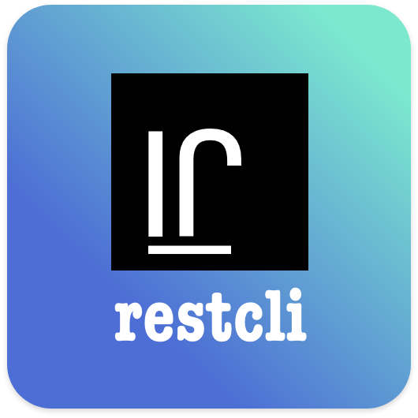
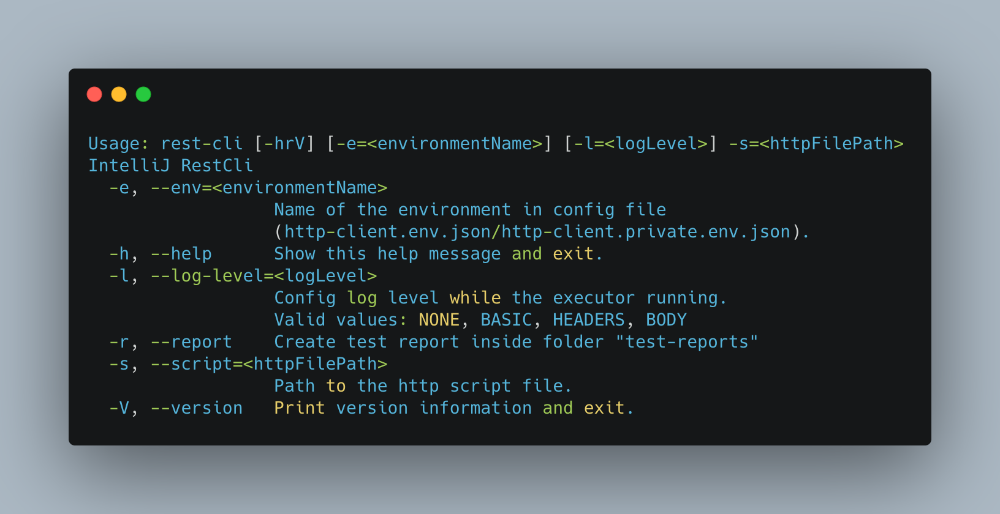
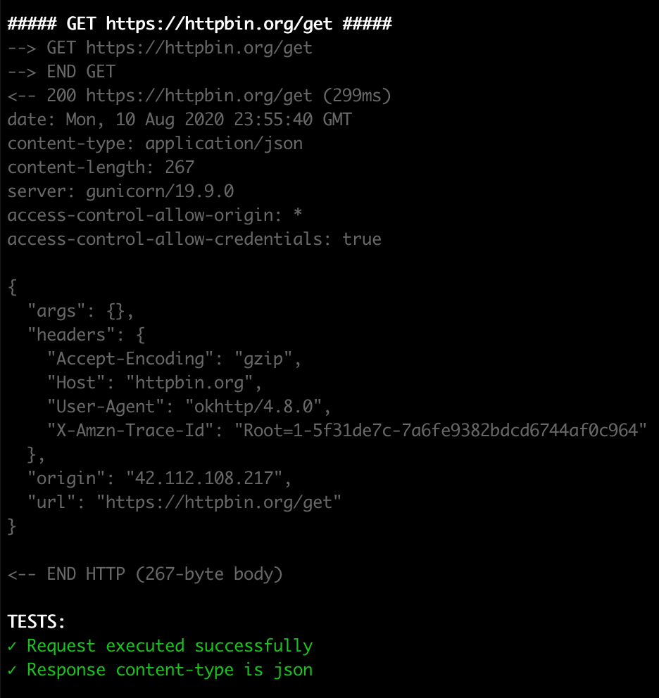
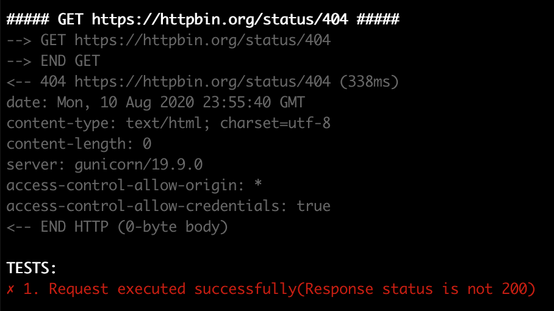
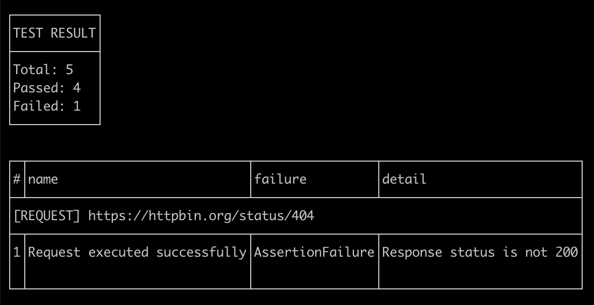
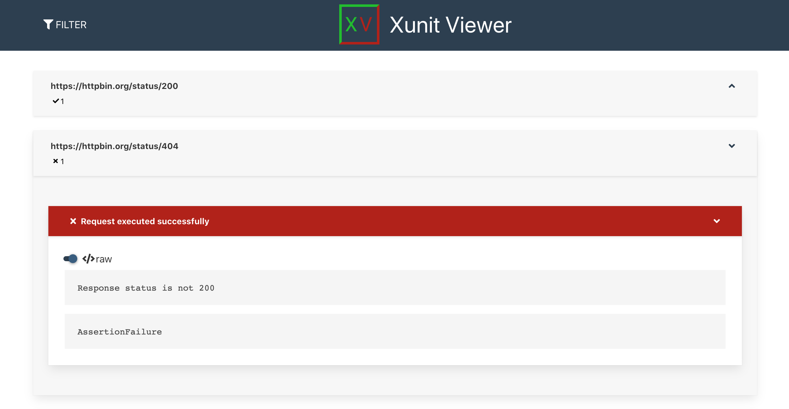

<!-- ALL-CONTRIBUTORS-BADGE:START - Do not remove or modify this section -->
[](#contributors-)
<!-- ALL-CONTRIBUTORS-BADGE:END -->
<h1 align="center">
  <br>
  <a href="https://github.com/restcli/restcli"></a>
  <br>
  restcli
  <br>
</h1>

<h4 align="center">A missing commandline application for execute <a href="https://www.jetbrains.com/help/idea/http-client-in-product-code-editor.html" target="_blank">IntelliJ HTTP Client file</a>.</h4>

<p align="center">
  <a href="https://github.com/restcli/restcli/releases/">
    
  </a>
  <a href="https://github.com/restcli/restcli/blob/master/LICENSE">
      
    </a>    
  <a href="https://paypal.me/quangson8128">
    
  </a>
</p>

<p align="center">
  <a href="#key-features">Key Features</a> •
  <a href="#how-to-use">How To Use</a> •
  <a href="#download">Download</a> •
  <a href="#credits">Credits</a> •
  <a href="#license">License</a> •
  <a href="https://www.producthunt.com/posts/intellij-rest-cli">Producthunt</a>
</p>



## Key Features
* Written by Kotlin 🤩
* Execute Intellij HTTP request files
* Running test script including:
    - Embedded script inside HTTP request file
    - Include external javascript test file
* Loading and inject environment variables from
    - http-client.env.json
    - http-client.private.env.json
* Cross platform 💻🖥️
  - Windows, macOS and Linux ready.
* Beautiful request log 🤑🤑🤑
  - Request & response detail
  - Test result table  
* Easy to custom via commandline arguments 😎
  - Custom logging request
  - Inject environment name
* Generate test report - junit format.  🥰🥰🥰
* Support setNextRequest. So you can custom flexbile the test flow. ✨✨✨

##### Demo


**1. Show detail request/response including test result**




**2. Test result table**



**3. Generate junit test report (xml) that can be viewed by other tools such as xunit-viewer**



## How To Use

The fastest way to get rest cli is download jar from [releases tab](https://github.com/restcli/restcli/releases)

```
Usage: rest-cli [-hV] [-e=<environmentName>] [-l=<logLevel>]
                [-r=<testReportNames>] FILES...
IntelliJ RestCli
      FILES...    Path to one ore more http script files.
  -e, --env=<environmentName>
                  Name of the environment in config file
                  (http-client.env.json/http-client.private.env.json).
  -h, --help      Show this help message and exit.
  -l, --log-level=<logLevel>
                  Config log level while the executor running.
                  Valid values: NONE, BASIC, HEADERS, BODY
  -r, --report-names=<testReportNames>
                  Custom test report names inside folder "test-reports".
                  The report names must separate by ':' character;
                  If the split string of the report name is empty, then the
                    test request file name will
                  be used for report name
                  Such as:
                  java -jar restcli.jar -r custom_report1::custom_report3 test1.
                    http test2.http test3.http
                  Then the test report for test1.http will be custom_report1.xml
                  test2.http -> test2.xml (Because the report name for test2.
                    http is empty)
                  test3.http -> custom_report3.xml
  -V, --version   Print version information and exit.
```

#### Example
```bash
# Move to folder that contains your http files.
$ cd requests

$ tree
├── get-requests.http
├── http-client.env.json
├── http-client.private.env.json
├── post-requests.http
├── request-form-data.json
├── requests-with-authorization.http
├── requests-with-tests.http
└── test_script.js

$ java -jar /path/to/restcli.jar -e "test" get-requests.http
```

Note: This application required you install `java` on your machine.

## Download

You can [download](https://github.com/restcli/restcli/releases) the latest version of restcli for Windows, macOS and Linux.

## Credits

This software uses the following open source packages:

- [Jflex](https://jflex.de/) -  a lexical analyzer generator (also known as scanner generator) for Java.
- [PicoCli](https://picocli.info/) - a mighty tiny command line interface
- [okhttp](https://github.com/square/okhttp) - the way modern applications network. It’s how we exchange data & media. Doing HTTP efficiently makes your stuff load faster and saves bandwidth.
- [picnic](https://github.com/JakeWharton/picnic) - A Kotlin DSL and Java/Kotlin builder API for constructing HTML-like tables which can be rendered to text.
- [mordant](https://github.com/ajalt/mordant) - Full-featured text styling for Kotlin command-line applications.

## Support

If you need help, please don't hesitate to [file an issue](https://github.com/restcli/restcli/issues/new).
 

## Sponsoring

This application is free and can be used for free, open source and commercial applications. `restcli` is under the MIT License (MIT). So hit the magic ⭐ button, I appreciate it!!! 🙏

## 🤝 Contributing
I appreciate your support and feedbacks!

Please file issues if you find bugs and have feature requests. If you are able to send small PRs to improve or fix bugs, that would be awesome too.

For larger PRs, please ping [@quangson91](https://twitter.com/quangson91) to discuss first.

## 📝 License

MIT License
```
Copyright (c) 2020 Duong Quang Son

Permission is hereby granted, free of charge, to any person obtaining a copy
of this software and associated documentation files (the "Software"), to deal
in the Software without restriction, including without limitation the rights
to use, copy, modify, merge, publish, distribute, sublicense, and/or sell
copies of the Software, and to permit persons to whom the Software is
furnished to do so, subject to the following conditions:

The above copyright notice and this permission notice shall be included in all
copies or substantial portions of the Software.

THE SOFTWARE IS PROVIDED "AS IS", WITHOUT WARRANTY OF ANY KIND, EXPRESS OR
IMPLIED, INCLUDING BUT NOT LIMITED TO THE WARRANTIES OF MERCHANTABILITY,
FITNESS FOR A PARTICULAR PURPOSE AND NONINFRINGEMENT. IN NO EVENT SHALL THE
AUTHORS OR COPYRIGHT HOLDERS BE LIABLE FOR ANY CLAIM, DAMAGES OR OTHER
LIABILITY, WHETHER IN AN ACTION OF CONTRACT, TORT OR OTHERWISE, ARISING FROM,
OUT OF OR IN CONNECTION WITH THE SOFTWARE OR THE USE OR OTHER DEALINGS IN THE
SOFTWARE.
```
---

<h2 class="text-white mb-4">Made with <span class="heart">❤</span> by quangson91</h2>

> [restcli.github.io](https://restcli.github.io/) &nbsp;&middot;&nbsp;
> GitHub [@quangson91](https://github.com/quangson91) &nbsp;&middot;&nbsp;
> Twitter [@quangson91](https://twitter.com/quangson91)

## Contributors ✨

Thanks goes to these wonderful people ([emoji key](https://allcontributors.org/docs/en/emoji-key)):

<!-- ALL-CONTRIBUTORS-LIST:START - Do not remove or modify this section -->
<!-- prettier-ignore-start -->
<!-- markdownlint-disable -->
<table>
  <tr>
    <td align="center"><a href="https://github.com/martinqvistgard"><br /><sub><b>Martin Qvistgård</b></sub></a><br /><a href="#userTesting-martinqvistgard" title="User Testing">📓</a></td>
    <td align="center"><a href="https://medium.com/@willitheowl"><br /><sub><b>Robert Jack Will</b></sub></a><br /><a href="#ideas-matey-jack" title="Ideas, Planning, & Feedback">🤔</a></td>
    <td align="center"><a href="https://github.com/gsobczyk"><br /><sub><b>gsobczyk</b></sub></a><br /><a href="https://github.com/restcli/restcli/commits?author=gsobczyk" title="Code">💻</a></td>
    <td align="center"><a href="https://github.com/pil0t"><br /><sub><b>Vlad</b></sub></a><br /><a href="#userTesting-pil0t" title="User Testing">📓</a></td>
  </tr>
</table>

<!-- markdownlint-enable -->
<!-- prettier-ignore-end -->
<!-- ALL-CONTRIBUTORS-LIST:END -->

This project follows the [all-contributors](https://github.com/all-contributors/all-contributors) specification. Contributions of any kind welcome!
